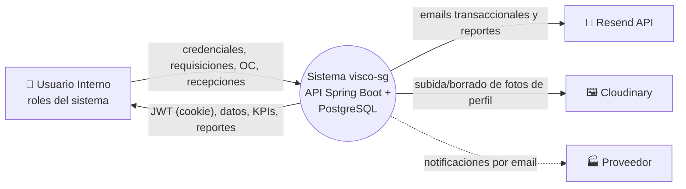
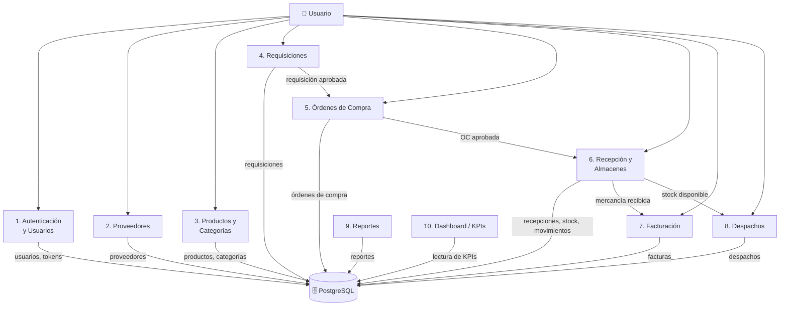
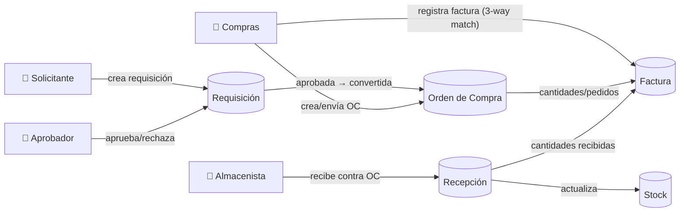

# Visco Orinoco (visco-sg) — Diagramas de Flujo de Datos (DFD)

## Nivel 0 — Diagrama de Contexto

```mermaid
flowchart LR
    U[👤 Usuario Interno<br/>roles del sistema]
    P[🏭 Proveedor]
    R[📧 Resend API]
    C[🖼️ Cloudinary]

    S((Sistema visco-sg<br/>API Spring Boot +<br/>PostgreSQL))

    U -->|"credenciales, requisiciones, OC, recepciones"| S
    S -->|"JWT (cookie), datos, KPIs, reportes"| U

    S -->|"emails transaccionales y reportes"| R
    S -->|"subida/borrado de fotos de perfil"| C
    S -.->|"notificaciones por email"| P
```

## Nivel 1 — Diagrama de Procesos Principales

```mermaid
flowchart TB
    U[👤 Usuario] --> P1
    U --> P2
    U --> P3
    U --> P4
    U --> P5
    U --> P6
    U --> P7
    U --> P8

    P1[1. Autenticación<br/>y Usuarios]
    P2[2. Proveedores]
    P3[3. Productos y<br/>Categorías]
    P4[4. Requisiciones]
    P5[5. Órdenes de Compra]
    P6[6. Recepción y<br/>Almacenes]
    P7[7. Facturación]
    P8[8. Despachos]
    P9[9. Reportes]
    P10[10. Dashboard / KPIs]

    DB[(🗄️ PostgreSQL)]

    P1 -->|"usuarios, tokens"| DB
    P2 -->|"proveedores"| DB
    P3 -->|"productos, categorías"| DB
    P4 -->|"requisiciones"| DB
    P5 -->|"órdenes de compra"| DB
    P6 -->|"recepciones, stock, movimientos"| DB
    P7 -->|"facturas"| DB
    P8 -->|"despachos"| DB
    P9 -->|"reportes"| DB
    P10 -->|"lectura de KPIs"| DB

    P4 -->|"requisición aprobada"| P5
    P5 -->|"OC aprobada"| P6
    P6 -->|"mercancía recibida"| P7
    P6 -->|"stock disponible"| P8
```

## Flujo de datos — Procure-to-Pay (detalle)

```mermaid
flowchart LR
    U[👤 Solicitante]
    A[👤 Aprobador]
    W[👤 Almacenista]
    F[👤 Compras]

    R1[(Requisición)]
    OC[(Orden de Compra)]
    GR[(Recepción)]
    INV[(Factura)]
    ST[(Stock)]

    U -->|"crea requisición"| R1
    A -->|"aprueba/rechaza"| R1
    R1 -->|"aprobada → convertida"| OC
    F -->|"crea/envía OC"| OC
    W -->|"recibe contra OC"| GR
    GR -->|"actualiza"| ST
    F -->|"registra factura (3-way match)"| INV
    OC -->|"cantidades/pedidos"| INV
    GR -->|"cantidades recibidas"| INV
```
